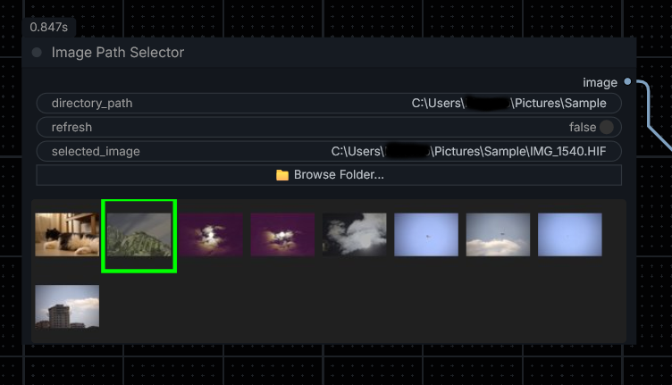

# ComfyUI-ImagePathSelector

A custom ComfyUI node that lets you visually browse a folder of images and select one to feed into your workflow — directly from the node's thumbnail grid.

---

## Features

- 🖼️ **Visual thumbnail grid** — displays all images in a chosen directory as a scrollable grid inside the node
- **Large hover preview** - move the cursor over any thumbnail to show a larger, higher-quality preview, then move away to hide it instantly
- 🖱️ **Click to select** — click any thumbnail to instantly queue and run the workflow with that image
- 📁 **Browse Folder button** *(Windows only)* — opens a native folder picker dialog
- ✅ **Green border highlight** on the currently selected image
- 🔄 **Refresh toggle** — force-reload the image list from disk (only processes new/removed files, not the whole folder)
- 🗂️ **Right-click → Reload Images** context menu option
- 💾 **Selection persists** across workflow saves and reloads
- ⚡ **SQLite thumbnail cache** — thumbnails are stored in a `.ImagePathSelector.db` file inside the image folder, making subsequent loads near-instant

---

## Supported Formats

| Format | Notes |
|---|---|
| JPEG, PNG, BMP, GIF, WebP | Always supported |
| HEIC / HEIF / HIF | Requires `pillow-heif` |
| CR2, CR3, NEF, ARW, DNG, ORF, RW2, RAF, RAW, PEF, SRW | Requires `rawpy` |

---

## Installation

### Via ComfyUI Manager *(recommended)*
Search for **ComfyUI-ImagePathSelector** in the ComfyUI Manager and install.

### Manual
```bash
cd ComfyUI/custom_nodes
git clone https://github.com/KursatAs/ComfyUI-ImagePathSelector
```

### Optional dependencies
For RAW camera format support:
```bash
pip install rawpy
```
For HEIC/HEIF support:
```bash
pip install pillow-heif
```

---

## Usage

1. Add the **Image Path Selector** node to your workflow (`image/selection` category).
2. Set the **`directory_path`** to the folder containing your images.
3. Run the workflow — the node will scan the folder and display a thumbnail grid.
4. Hover over a thumbnail to inspect a larger preview, or **click a thumbnail** to select it. The workflow will automatically re-queue and pass the selected image downstream.
5. The selected image path is shown below the grid. The selected thumbnail is highlighted with a **green border**.

### Inputs

| Name | Type | Description |
|---|---|---|
| `directory_path` | STRING | Absolute path to the image folder |
| `refresh` | BOOLEAN | Toggle to force a rescan of the directory |
| `selected_image` | STRING | Path of the currently selected image (set automatically on click) |

### Outputs

| Name | Type | Description |
|---|---|---|
| `image` | IMAGE | The selected image as a tensor, ready for use in your workflow |

> **Note:** If no image has been selected yet, the node will block workflow execution and wait for the user to click a thumbnail.

---

## Tips

- On **Windows**, use the **📁 Browse Folder...** button to open a native folder picker instead of typing the path manually.
- Use **right-click → Reload Images** or toggle the **Refresh** checkbox to pick up newly added files without restarting ComfyUI. On refresh, only new/removed files are processed — existing cached thumbnails are reused.
- Hover previews use a larger cached preview image, while the grid itself stays compact with 64px thumbnails.
- Because preview images are cached at a larger size, `.ImagePathSelector.db` may be larger than in older versions. Existing caches are rebuilt automatically when needed.
- The thumbnail cache is automatically invalidated when the directory path changes or the thumbnail size changes.
- The first load of a folder generates thumbnails and saves them to `.ImagePathSelector.db` inside that folder. Subsequent loads read directly from the cache and are much faster.
- On **Windows**, `.ImagePathSelector.db` is automatically hidden so it doesn't clutter your folder.
- If the database file becomes corrupt it is automatically deleted and rebuilt from scratch.
- If ComfyUI does not have write permission to the image folder, thumbnail caching is silently skipped and thumbnails are generated in memory as before.
- RAW image formats load more slowly because they usually have larger file sizes. It is not recommended to load a folder containing more than approximately 50–100 images.


---

## Requirements

- ComfyUI
- Python packages: `Pillow`, `torch`, `numpy`
- *(Optional)* `rawpy` — for RAW camera formats
- *(Optional)* `pillow-heif` — for HEIC/HEIF formats

---

## License

See [LICENSE](LICENSE).

---
## Changelog

### 1.0.5     (2026-06-12)
- **Large hover previews** - hovering over a grid thumbnail now shows a larger preview image that updates immediately as the cursor moves between thumbnails.
- **Higher-quality preview cache** - cached preview images are stored at a larger size so hover previews stay sharp while the grid remains compact.
- 
- **Existing thumbnail caches are rebuilt automatically** when the cached preview size changes, so older 64px caches will be upgraded without manually deleting `.ImagePathSelector.db`. if you want to force an immediate upgrade, simply delete the existing `.ImagePathSelector.db` file from the image folder and it will be rebuilt with the new preview size on the next load.

### 2026-06-01
- **SQLite thumbnail cache** — thumbnails are now persisted to a `.ImagePathSelector.db` file inside the image folder (hidden on Windows). Subsequent loads read from the database instead of re-generating thumbnails, making folder loads near-instant.
- **Smart refresh** — toggling *Refresh* now only processes files that are new or have been removed; existing cached thumbnails are reused, making refresh much faster for large folders.
- **Auto-recovery** — a corrupt database file is automatically detected, deleted, and rebuilt from scratch.
- **Graceful fallback** — if the image folder is read-only, caching is silently skipped and thumbnails are generated in memory as before.

### 1.0.1
- Bumped version, updated Comfy Registry link.

### 1.0.0
- Initial release.

---

## Links

- 🐛 [Bug Tracker](https://github.com/KursatAs/ComfyUI-ImagePathSelector/issues)
- 📖 [Documentation / Wiki](https://github.com/KursatAs/ComfyUI-ImagePathSelector/wiki)
- 📦 [Comfy Registry](https://registry.comfy.org/nodes/ComfyUI-ImagePathSelector)

